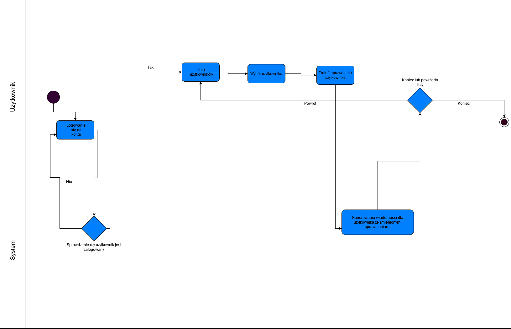

# Programowanie Zespołowe - Ankiety (20L2G4)

### Opis projektu

Aplikacja Panelu Ankietowego ma na celu zdobycie cennych informacji od użytkowników wypełniających ankiety w zamian za nagrody.

Aby korzystać z aplikacji zwykły użytkownik, który wypełnia ankiety musi się zarejestrować, a następnie zalogować. Po poprawnym zalogowaniu użytkownik ma dostęp do aktywnych ankiet, których nie wypełnił wraz z liczbą punków, które może uzyskać za daną ankietę. Panel użytkownika daje możliwość edycji profilu. W panelu nagród użytkownik może wymienić zgromadzone punkty na dostępne nagrody, informacja wizualna przedstawia czy użytkownik ma wystarczającą liczbę punktów na wymianę, jeśli nie ma pojawi się odpowiedni błąd przy wymianie. Natomiast jeśli wymiana się powiedzie, to zostanie utworzony kupon lub potwierdzenie wymiany w formie pliku pdf w katalogu użytkownika w folderze pobrane.

Twórca ankiet ma dostęp do stworzonych przez siebie ankiet, może przeglądać analizę ankiety oraz edytować ankietę, jeśli jeszcze się nie rozpoczęła. Twórca ankiet może również tworzyć nowe ankiety poprzez generator ankiet, w którym ma możliwość zredagowania pytanie w formie tekstu i zdjęcia oraz odpowiedzi do tego pytania. Odpowiedzi mogą mieć wiele form od pól typu checkbox z kilkoma możliwymi odpowiedziami do zaznaczenia, przez pola z jedną możliwą odpowiedzią, po pola tekstowe. Możliwe są również pola, gdzie trzeba będzie rozdzielić punkty na kilka odpowiedzi i ich pełna pula musi zostać rozdzielona lub przydzielona musi być liczba procent do jednej odpowiedzi. Każda ankieta może mieć dowolną liczbę punktów do uzyskania wprowadzoną przez twórcę, jednak data rozpoczęcia nie może być starsza niż zakończenia ankiety. Twórca ankiet nie widzi ankiet stworzonych przez innych ankieterów.

Osoba odpowiedzialna za nagrody ma możliwość podglądu i edycji już istniejących nagród oraz może dodawać nowe nagrody wraz ze zdjęciami i ustawiać ich cenę czyli liczbę punków za jakie mogą zostać wymienione. Nagrody mogą być w formie generowanego kuponu lub przedmiotu wysyłanego na adres domowy użytkownika.

Administrator ma dostęp do kont wszystkich użytkowników, może edytować ich profile w tym nadawać im uprawnienia twórcy ankiet lub osoby odpowiedzialnej za nagrody, a także administratora. Może również blokować dostęp do wybranego konta.

### Diagram przypadków użycia

### Diagram klas

### Diagram encji

### Diagramy aktywności:

##### - użytkownika

##### - administratora

##### - twórcy ankiet

##### - twórcy nagród

### Diagram stanów ankiety

