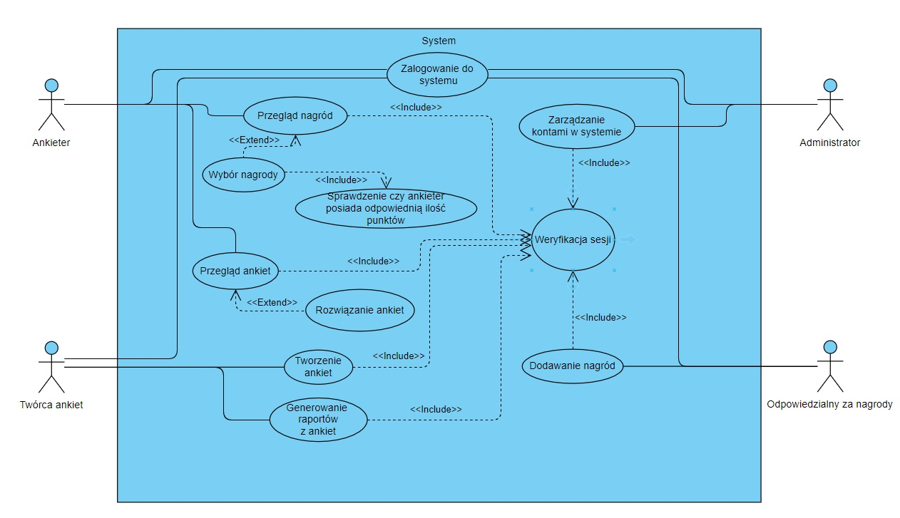
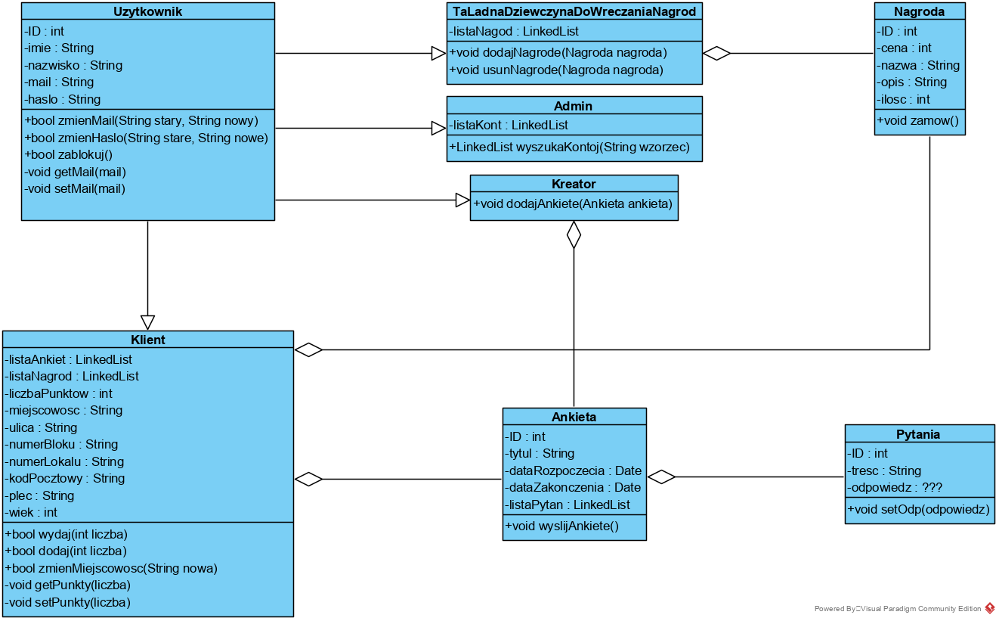
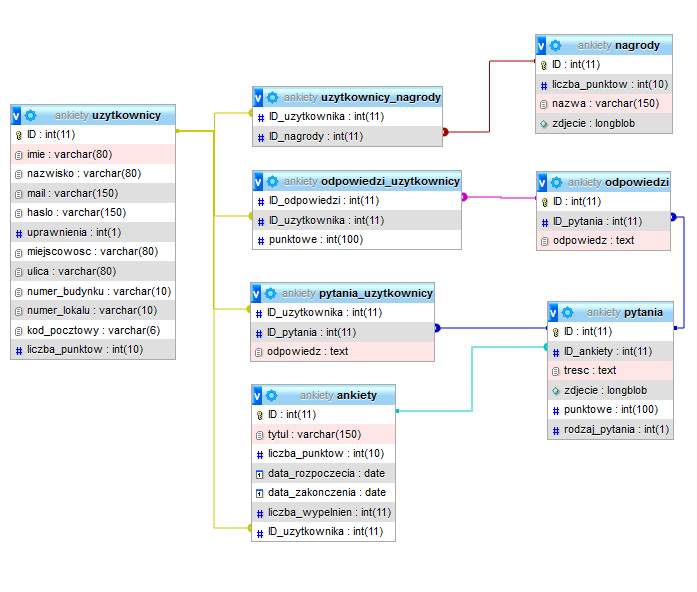
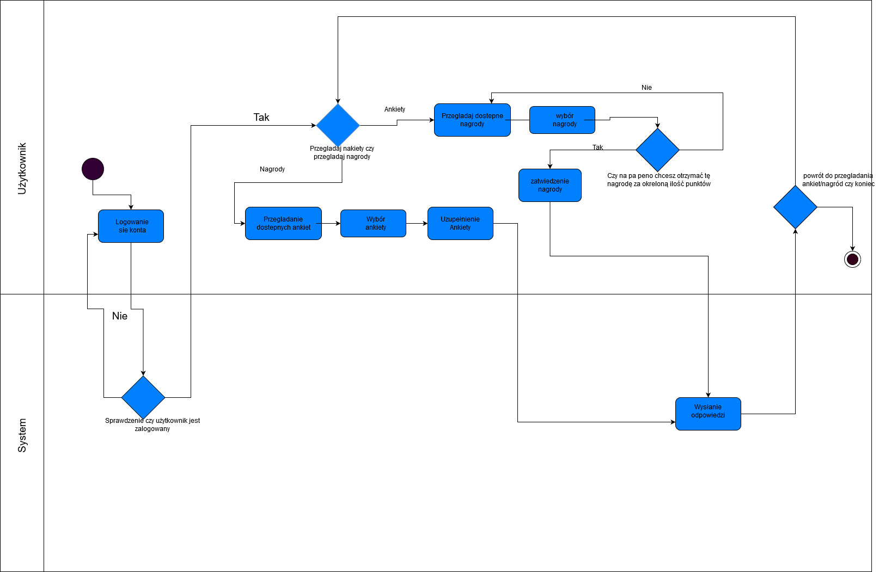
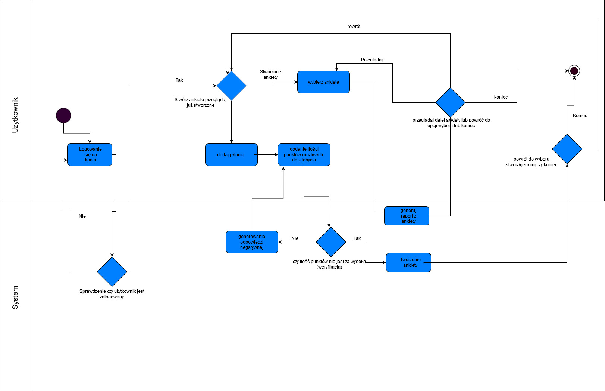
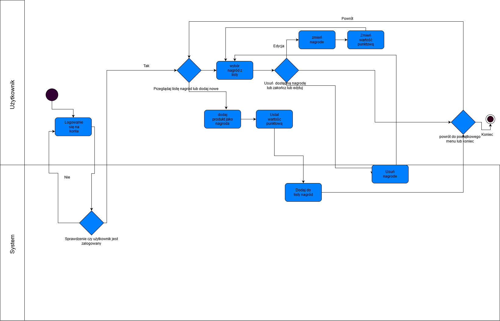
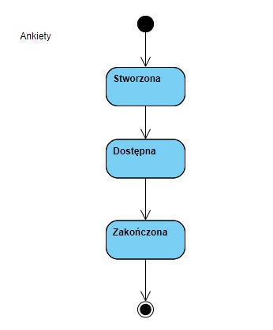

# Programowanie Zespołowe - Ankiety (20L2G4)

### Diagram przypadków użycia

### Diagram klas

### Diagram encji

### Diagramy aktywności:

##### - użytkownika

##### - administratora

##### - twórcy ankiet

##### - twórcy nagród

### Diagram stanów ankiety

