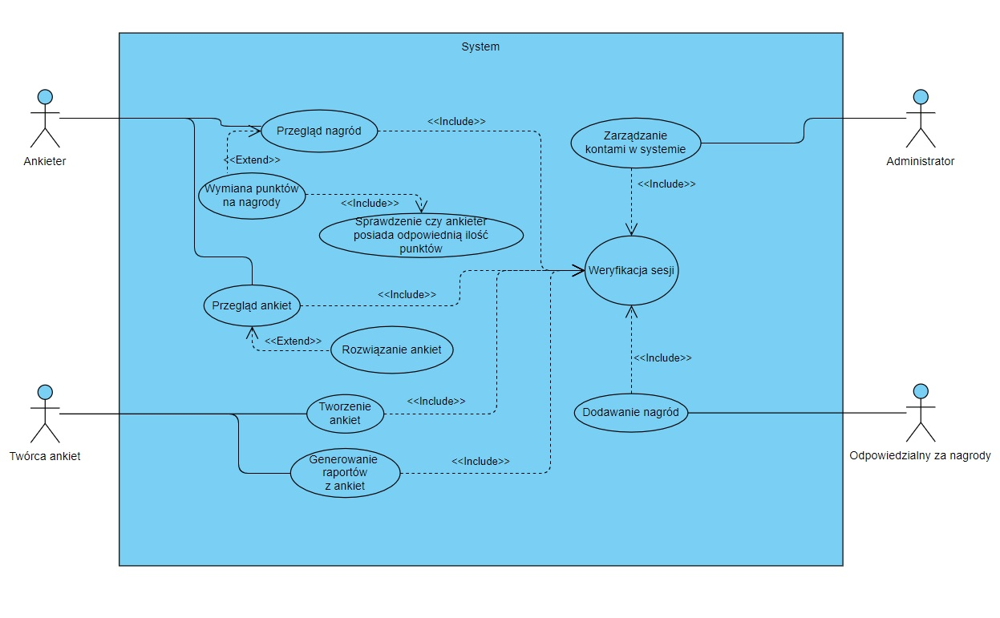

# ProgramowanieZaspolowe-Ankiety

### Diagram przypadków użycia

### Diagram klas

### Diagram encji

### Diagram aktywności

### Diagram aktywności Twórcy Ankiet

### Diagram aktywności Odpowiedzialnego za nagrody

### Diagram aktywności Odpowiedzialnego za nagrody

### Diagram stanów

